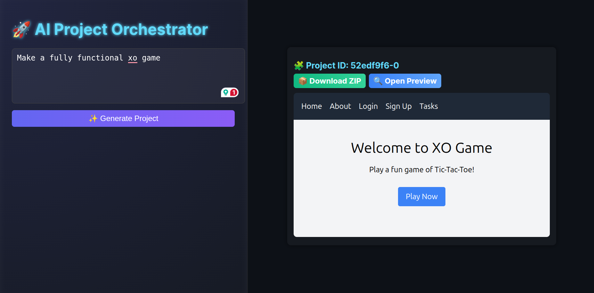
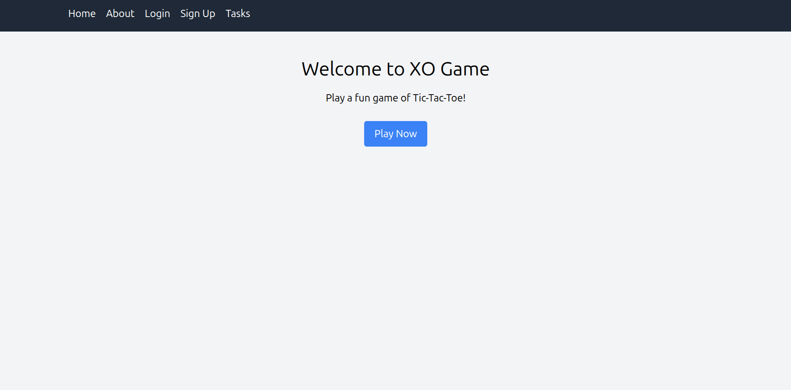
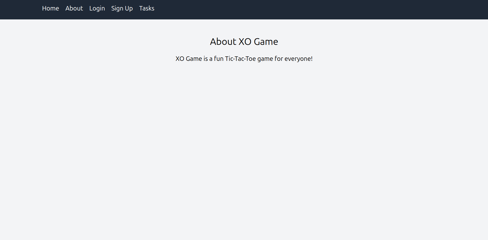
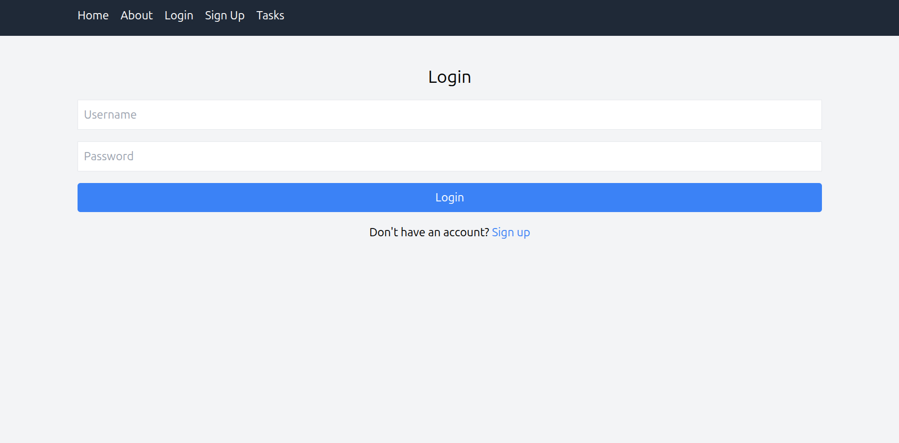
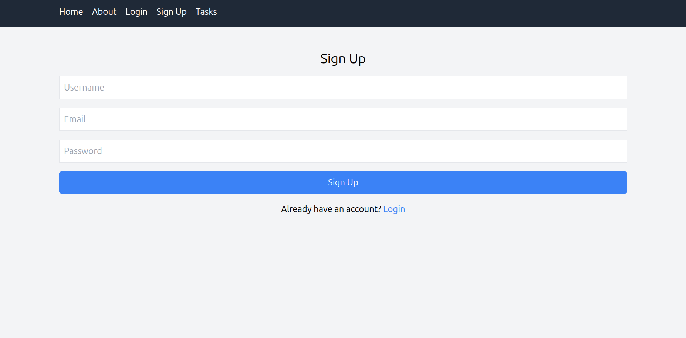
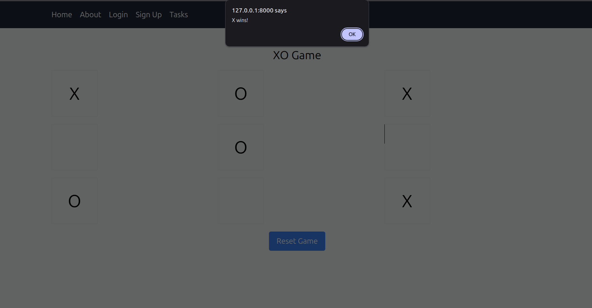

# 🧠 AI Website Builder

**AI Website Builder** is a full-stack project built using **FastAPI** and **OpenAI API**, allowing users to generate complete multi-page websites (HTML, CSS, JS) automatically from text descriptions.
It also includes user authentication (signup/login), task management, and automatic project zipping and previewing.

---


## 🖼️ Screenshots

### 🔹 Main Pages

| Main Project Genarator Page |
| --------------------------- |
|       |

### 🔹 Genarated Pages

| Home                   | About                    | Login                    | Signup                     |
| ---------------------- | ------------------------ | ------------------------ | -------------------------- |
|  |  |  |  |

### 🔹 Game Page

| Tasks Page             |
| ---------------------- |
|  |

---


## ▶️ Demo Video

[](https://www.youtube.com/watch?v=YOUR_VIDEO_ID_HERE)

> 🎥 *Click the thumbnail above to watch the full demo on YouTube.*
>

---


## 🚀 Features

- 🔥 Generate full multi-page websites using AI (OpenAI GPT models)
- 📁 Automatic project folder creation with unique IDs
- 🧾 Each project includes:
  - `index.html`
  - `login.html`
  - `signup.html`
  - `about.html`
  - `tasks.html`
- ⚡ Built-in base `<base>` tag injection for relative link handling
- 📦 Automatic ZIP download for each generated project
- 👤 User authentication system (SQLite + FastAPI)
- 📝 Task management for logged-in users
- 🌍 Frontend served via local folder preview
- 🔒 Secure JSON parsing for generated output

---

## 🧰 Tech Stack

**Backend:**

- FastAPI
- SQLAlchemy
- SQLite
- OpenAI API
- Python 3.10+

**Frontend:**

- HTML + CSS + JavaScript (AI-generated)
- TailwindCSS (via CDN)

---

## 📦 Installation & Setup

### 1️⃣ Clone the repository

```bash
git clone https://github.com/Subrata0Ghosh/ai-website-builder.git
cd ai-website-builder
```

### 2️⃣ Create and activate a virtual environment

```bash
python3 -m venv venv
source venv/bin/activate
```

### 3️⃣ Install dependencies

```bash
pip install -r requirements.txt
```

### 4️⃣ Add your OpenAI API key

Create a file named `.env` in the project root:

```
OPENAI_API_KEY=sk-your-key-here
```

### 5️⃣ Run the server

```bash
uvicorn main:app --reload
```

Server will start at:

```
http://127.0.0.1:8000
```

---

## 🧠 API Endpoints

| Endpoint                                        | Method | Description                        |
| ----------------------------------------------- | ------ | ---------------------------------- |
| `/generate/`                                  | POST   | Generate a new AI website project  |
| `/download/{project_id}.zip`                  | GET    | Download the generated project ZIP |
| `/api/signup`                                 | POST   | Create a new user                  |
| `/api/login`                                  | POST   | Login user                         |
| `/api/tasks/{username}`                       | GET    | Fetch user tasks                   |
| `/api/tasks`                                  | POST   | Add new task                       |
| `/api/tasks/{task_id}`                        | DELETE | Delete a task                      |
| `/generated_projects/{project_id}/{filename}` | GET    | Serve generated HTML/CSS/JS        |

---

## 🧩 Example: Generate a Project

Send a request:

```bash
curl -X POST http://127.0.0.1:8000/generate/ \
  -H "Content-Type: application/json" \
  -d '{"description": "a portfolio website with about, login, and contact pages"}'
```

Response:

```json
{
  "project_id": "a1b2c3d4e5",
  "message": "Project generated successfully"
}
```

Visit in browser:

```
http://127.0.0.1:8000/generated_projects/a1b2c3d4e5/index.html
```

---

## 🗂 Project Structure

```
AI-WEBSITE-BUILDER/
├── backend/ # FastAPI backend (app.py, database, AI logic)
├── frontend/ # React frontend (UI, components, pages)
├── images/ # App screenshots and assets
├── old-versions/ # Previous archived versions (zip files)
├── .env # Environment variables
├── requirements.txt # Python dependencies
└── README.md # Project documentation
```

---

## ⚙️ Example .env File

```
OPENAI_API_KEY=sk-your-openai-key
```

---

## 📦 Packaging & Version Control

Initialize git:

```bash
git init
git add .
git commit -m "Initial commit"
git branch -M main
git remote add origin https://github.com/Subrata0Ghosh/ai-website-builder.git
git push -u origin main
```

---

## 🧪 Troubleshooting

| Issue                         | Possible Fix                                                                  |
| ----------------------------- | ----------------------------------------------------------------------------- |
| `500 Internal Server Error` | Check your `.env`key, increase `max_output_tokens`, or view terminal logs |
| JSON parsing error            | The AI output may contain markdown or invalid escape characters               |
| Links not working             | Ensure `<base>`tag injection logic is present                               |
| `.zip`file missing          | Check `generated_projects/`folder permissions                               |

---

## 💡 Future Enhancements

* Add frontend React interface
* Integrate preview in a live iframe
* Support for exporting to GitHub Pages
* Optional themes (dark/light)
* Database-based project history

---


## 🪄 License

This project is released under the  **MIT License** .

You can freely use, modify, and distribute this software.
